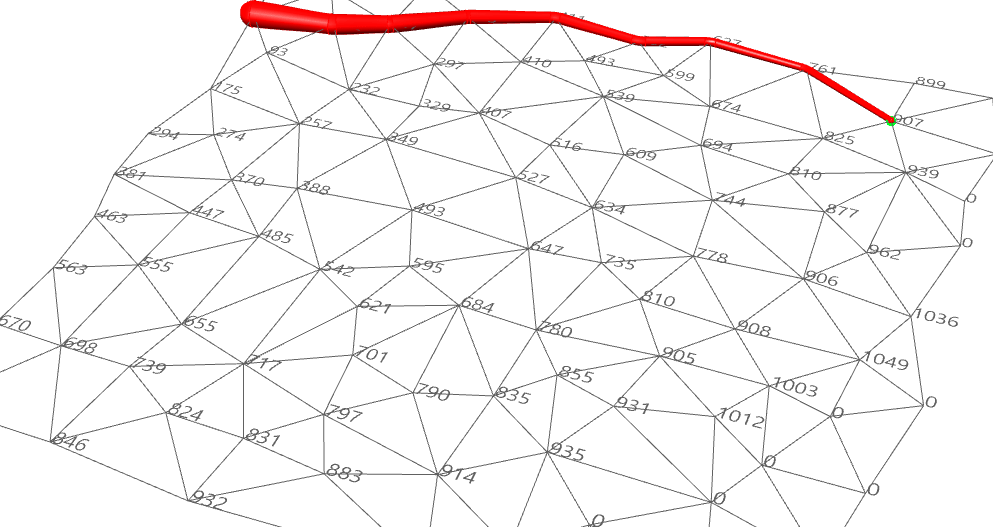
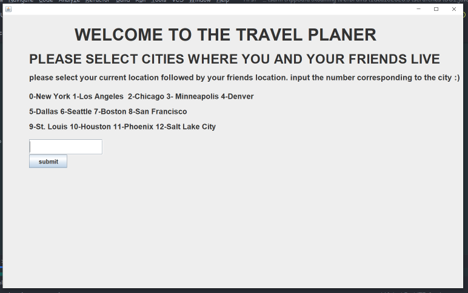
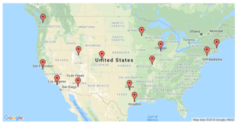
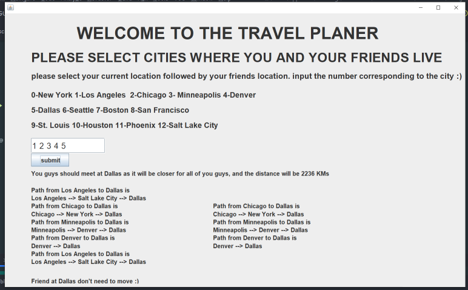

# TRAVEL-PLANNER

  A program which help to find the best destination to meet your friends based on the minimum distance as possible.

# ALGORITHMS
dijkstra algorithm is used as a core algorithm with some minor tweaks to meet the desirable output.

# WORKING
just put your location followed by for friends location.

select the cities from the map shown and input the adjcent number.

below is shown the distance from each city to every city.

# OUTPUT
The output consists of:-

The destination city which will be closer for all all of your friends including you.

The path for each person from their city to destination (the shortest path).

